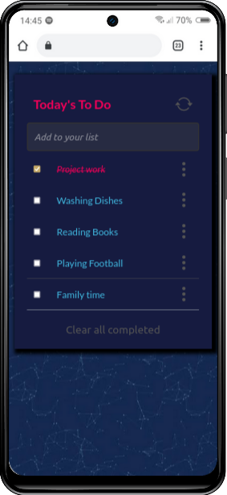

  

# Awesome Books
This project allows users to add/remove todo-list from a list. This is done by using JavaScript ES6. 
## Screenshot

## Built with

- Major languages: HTML, CSS, JavaScript
- Technologies used: Github, Linters, Webpack

## Getting Started

Clone the repository and setup the linter

## Prerequisites

- npm ( Node Package Manager )
- git and Github Account

### Setup

To get a local copy up and running follow these simple example steps.

- Open terminal
- Change the directory you want put the repo
- Then run
  i. Run git clone git@github.com:mengiefen/awesome-books.git
  ii. cd repo-name/

### Install

- **Webhint** linter

  `npm install --save-dev hint@6.x`

- **Stylelint** linter

  `npm install --save-dev stylelint@13.x stylelint-scss@3.x stylelint-config-standard@21.x stylelint-csstree-validator@1.x`

- **ESLint** linter

  `npm install --save-dev eslint@7.x eslint-config-airbnb-base@14.x eslint-plugin-import@2.x babel-eslint@10.x`

### Run tests

- **Webhint** linter -`npx hint .` on the root of your directory of your project.
- **Stylelint** linter
  - `npx stylelint "**/*.{css,scss}"` on the root of your directory of your project.
- **ESLint** linter
  - `npx eslint .` on the root of your directory of your project.

## Authors

👤 **Mengstu Fentaw**

- Github: [@mengiefen](https://github.com/mengiefen)
- Twitter: [@MengistuFentaw](https://twitter.com/MengistuFentaw)
- Linkedin: [@mengefen](https://www.linkedin.com/in/mengefen/)

## Contributers

## Acknowledgments

- To morning session team,reviewers and standup team memebers.

## Live Demo

**[FOLLOW THIS LINK TO SEE THE LIVE DEMO](https://mengiefen.github.io/todo-list/)**

## 📝 License

This project is [MIT](./MIT.md) licensed.
